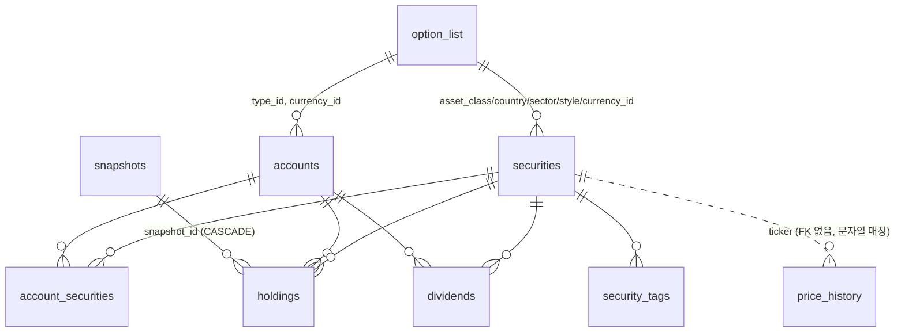

# Finance 앱 — 전체 구조 · 기능 · 로직 정리

> 작성일: 2026-08-14 / 기준 커밋: `eb0daa1` / DB: 운영 서버(`fin.lakipiece.com`) 라이브 스키마 실측
> 목적: 현재 구현된 모든 페이지의 기능·데이터 흐름·계산 로직을 한 곳에 정리하고, 개선점을 우선순위별로 도출한다.

> **2026-08-14 개선 적용됨** — 이 문서의 개선점 중 다음이 같은 날 반영되었다:
> - **신규**: 계좌 입출금 원장(`/portfolio/cashflows`, `account_cashflows`) + 대시보드 실질수익 KPI → [설계](plans/2026-08-14-account-cashflows-design.md)
> - **P0 #4,5,6,8**: 평가 로직 단일화 → [`lib/portfolio/valuation.ts`](../lib/portfolio/valuation.ts) (환율 fallback 상수·KRW 판정·가격 키 조회·KST 거래일 통일)
> - **P1 #19**: refresh-values N+1 제거, **#24**: 개별 가격 새로고침 티커 검증, **#16**: 인덱스 마이그레이션
> - **P1 #22**: bcrypt 해시 비교(하위호환) + `2026-08-14-password-bcrypt.sql`
> - **8.5 죽은 코드**: 컴포넌트 21개(±3.7k줄)·미사용 API 5개·루트 잔재 삭제, input 페이지 미사용 폼 제거,
>   expense_memos 로직 제거, 깨진 포트폴리오 import 기능 삭제, `docs/schema.sql` 라이브 기준 재생성
> - **P1 #10**: 미사용 테이블 DROP 마이그레이션(`2026-08-14-cleanup-unused.sql`, 수동 적용)
> - **디자인 규격화**: `PageHeader` 공통 컴포넌트 + `brand` 색상 상수, 전 페이지 헤더 통일

> **2026-08-15 — 수익 지표 체계 확정** (→ 상세: [portfolio-metrics.md](portfolio-metrics.md), 9장의 계획 실현)
> - 지표 재정의: **투자원금**=누적입금(원장) / **평균매수금액**=수량×평균단가 / **평가손익** / **수익금액**=평가액+출금−입금
> - 계좌별 하이브리드 규칙(원장 계좌는 입금 기준, 미기록 계좌는 매수원가 폴백)을
>   [`lib/portfolio/metrics.ts`](../lib/portfolio/metrics.ts) 단일 코어로 대시보드·스냅샷 목록·차트·편집에 일관 적용
> - 입출금 입력은 계좌 모달의 탭(종목 연결|입출금)으로 통합, 스냅샷 목록은 월별 그루핑+필터(목록↔차트 연동)
> - `snapshots.account_breakdown`(jsonb) 추가 — 값 갱신 시 계좌별 {평가액, 매수원가} 저장

---

## 0. 한눈에 보기

| 구분 | 내용 |
|------|------|
| 성격 | 개인 재무 관리 앱 = **가계부**(수입/지출/예산/에너지) + **포트폴리오**(투자) + **자산**(유형·연금·금융 통합) |
| 규모 | 페이지 22개(리다이렉트 7개 포함), API 라우트 51개, 컴포넌트 40개, 코드 약 23.7k LOC |
| 데이터 | expenses 11,681 / incomes 615 / holdings 1,459 / price_history 12,998 / dividends 201 / securities 66 / accounts 22 |
| 핵심 설계 | 포트폴리오는 **거래(transaction) 원장이 아니라 스냅샷(snapshot) 기반**. 시점별 `수량 × 평균단가`를 직접 입력해 관리 |
| 가장 큰 구조적 한계 | 매수/매도/입출금 이력이 없어 **실현손익·현금흐름 기반 수익률 산출 불가** (→ 9장) |

---

## 1. 시스템 개요

### 1.1 스택

| 레이어 | 기술 | 비고 |
|--------|------|------|
| 프레임워크 | Next.js 14 App Router, React 18, TypeScript | 모든 페이지 `export const dynamic = 'force-dynamic'` |
| DB | PostgreSQL 16 | 클라이언트 `postgres.js` (template literal SQL), ORM 없음 |
| 인증 | NextAuth v5 (Credentials) | `middleware.ts`에서 전 경로 게이트 |
| 차트 | Recharts | Bar(stacked) / Line / Pie / Composed |
| 스타일 | Tailwind + [`lib/styles.ts`](../lib/styles.ts) 상수(`btn`, `field`, `modal`, `badge`, `tbl`, `text`) | 아이콘은 전부 인라인 SVG |
| DnD | @dnd-kit | 계좌 정렬, 세부유형 정렬 |
| 외부 API | Yahoo Finance 2(주식/ETF/환율), CoinGecko(코인), Google Sheets API(가계부·포트폴리오 import) | |
| 배포 | miniPC + Docker Compose(db / app / cloudflared) | Vercel·Supabase 미사용 |

### 1.2 요청 처리 흐름

```
브라우저
  └─ middleware.ts (세션 없으면 /login 리다이렉트, '/' → '/portfolio')
       └─ Server Component (page.tsx) ── getSql() ──► PostgreSQL
       └─ Client Component ── fetch('/api/...') ──► Route Handler ── getSql() ──► PostgreSQL
                                                                  └─ Yahoo / CoinGecko / Google Sheets
```

* **서버 컴포넌트 직결**: 포트폴리오 계열 페이지 대부분 (`/portfolio`, `/portfolio/snapshots`, `/portfolio/accounts` …)
* **클라이언트 fetch**: 가계부 계열 대부분 (`/expenses`, `/input`, `/budget`, `/energy`, `/assets`)
* 두 방식이 혼재하며 통일된 규칙은 없다.

### 1.3 인증 · 캐시

* [`lib/auth.ts`](../lib/auth.ts) — `users.password_hash`와 입력값을 **평문 비교**(`credentials.password !== user.password_hash`). `bcryptjs` 의존성은 설치돼 있으나 미사용.
* [`middleware.ts`](../middleware.ts) — `/login`, `/api/auth/*`, `/api/portfolio/prices/refresh`만 예외. 나머지 전부(페이지·API) 세션 필수.
* [`lib/cache.ts`](../lib/cache.ts) — 프로세스 메모리 `Map` + TTL 60초. 쓰기 API에서 `invalidateCache()`로 전체 클리어. 단일 컨테이너 전제.
* 캐시 사용처: `summary-{year}`, `cat-{year}-{category}`, `data-{year}`, `year-{year}` 4종.

---

## 2. 라우팅 맵

### 2.1 페이지

| 경로 | 성격 | 진입 컴포넌트 | 주 데이터 소스 |
|------|------|----------------|----------------|
| `/` | 리다이렉트 → `/portfolio` | — | — |
| `/login` | 로그인 | [`app/login/page.tsx`](../app/login/page.tsx) | NextAuth |
| **가계부** | | | |
| `/expenses` | 대시보드(수입·지출 통합 드릴다운) | `DashboardClient` → `DrilldownPanel` | `/api/summary`, `/api/incomes/summary`, `/api/category-details`, `/api/expenses`, `/api/incomes` |
| `/input` | 수입·지출 입력/조회/수정 | [`app/input/page.tsx`](../app/input/page.tsx) (1,461줄 단일 파일) | `/api/expenses`, `/api/incomes`, `/api/options/*` |
| `/budget` | 연간 예산 계획 vs 실적 | `BudgetClient` | `/api/budgets` |
| `/energy` | 전기·수도·온수·난방 요금 | `EnergyClient` | `/api/energy` |
| `/compare` | 연도별 비교 | `CompareClient` → `CompareCharts` | `/api/year-data`, `/api/incomes/summary` |
| `/options` | 멤버·결제수단·세부유형·카테고리 색상 | `OptionsClient` | `/api/options/*` |
| **포트폴리오** | | | |
| `/portfolio` | 대시보드(보유/수익률/필터) | `PortfolioDashboard` | `fetchPortfolioSummary()` (서버) |
| `/portfolio/snapshots` | 스냅샷 목록 | `SnapshotList` | `snapshots` 테이블 |
| `/portfolio/snapshots/[id]` | 스냅샷 편집(계좌별 수량·단가 입력) | `SnapshotEditor` | `holdings` + `/api/portfolio/prices-at` |
| `/portfolio/snapshots/charts` | 자산 추이 차트 | `SnapshotCharts` | `snapshots.*_breakdown` |
| `/portfolio/income` | 배당·분배금 | `IncomeDashboard` | `dividends` + `fetchPortfolioSummary()` |
| `/portfolio/accounts` | 계좌 관리 + 종목 연결 | `AccountsManager` | `accounts`, `account_securities` |
| `/portfolio/securities` | 종목 마스터 + 가격/보유현황 | `SecuritiesManager` | `securities`, `price_history` 전량 |
| `/portfolio/securities/prices` | 가격 이력 뷰어 | `PriceHistoryViewer` | `price_history` 전량 |
| `/portfolio/options` | 분류 옵션(섹터/자산군/스타일/국가/통화/계좌유형) | `OptionsManager` | `option_list` |
| `/portfolio/rebalance` | 목표비율 vs 현재비중 | `RebalanceDashboard` | `target_allocations` |
| `/portfolio/import` | 구글시트 → 포트폴리오 import | `PortfolioImport` | `/api/portfolio/import` |
| **자산 / 설정** | | | |
| `/assets` | 유형·연금·금융자산 통합 | `AssetsClient` | `/api/assets`, `/api/pension-assets`, `/api/portfolio/snapshots` |
| `/settings` | 데이터 import·옵션·로그아웃 | `SettingsClient` + `HistoricalPriceFetcher` | `/api/sheets`, `/api/upload`, `/api/insert` |
| 리다이렉트 | `/monthly`→`/`, `/income`·`/incomes/input`·`/expenses/input`→`/input`, `/admin`·`/portfolio/settings`→`/settings`, `/portfolio/holdings`→`/portfolio/accounts` | | |

**네비게이션**: [`components/Sidebar.tsx`](../components/Sidebar.tsx)가 유일한 실사용 네비. `/portfolio/import`, `/portfolio/securities/prices`, `/portfolio/snapshots/charts`는 사이드바에 없고 내부 링크로만 접근.

### 2.2 API 라우트 요약

| 그룹 | 엔드포인트 | 메서드 | 인증 |
|------|-----------|--------|------|
| 가계부 | `/api/summary`, `/api/category-details`, `/api/year-data`, `/api/years` | GET | 미들웨어만 |
| | `/api/expenses` | GET (year/month/category/detail/all+q) | 미들웨어만 |
| | `/api/expenses/create`, `/api/expenses/[id]` | POST/GET/PATCH/DELETE | `auth()` ✅ |
| | `/api/expenses/memos`, `/api/expenses/suggestions` | GET | `auth()` ✅ |
| | `/api/incomes`, `/api/incomes/[id]`, `/api/incomes/summary`, `/api/incomes/suggestions` | GET/POST/PATCH/DELETE | 쓰기만 `auth()` |
| | `/api/budgets` | GET/PUT | PUT만 `auth()` |
| | `/api/energy`, `/api/energy/[id]` | GET/POST/PATCH/DELETE | 쓰기만 `auth()` |
| | `/api/options/{categories,details,members,methods}(/[id])` | GET/POST/PATCH/DELETE | 쓰기만 `auth()` |
| | `/api/sheets`, `/api/upload`, `/api/insert` | POST | `auth()` ✅ |
| 자산 | `/api/assets(/[id])(/valuations(/[valId]))`, `/api/pension-assets(/[id])(/snapshots(/[sid]))` | CRUD | 쓰기만 `auth()` |
| 포트폴리오 | `/api/portfolio/accounts(/reorder)`, `/securities(/[id]/tags)`, `/account-securities`, `/options(/[id])` | CRUD | 쓰기만 `auth()` |
| | `/api/portfolio/holdings(/[id])`, `/snapshots(/[id](/export))`, `/snapshots/refresh-values` | CRUD | 쓰기만 `auth()` |
| | `/api/portfolio/dividends(/[id])`, `/dividends/update-tax`, `/sells`, `/targets` | CRUD | 쓰기만 `auth()` |
| | `/api/portfolio/prices`, `/prices-at`, `/prices/history`, `/prices/refresh`, `/prices/refresh/ticker` | GET/POST | refresh만 CRON_SECRET 또는 세션 |
| | `/api/portfolio/import` | POST | `auth()` ✅ |

---

## 3. 데이터 모델 (라이브 스키마 실측)

### 3.1 가계부

| 테이블 | 행 수 | 역할 | 핵심 컬럼 |
|--------|------:|------|-----------|
| `expenses` | 11,681 | 지출 원장 | `expense_date, year, month, category, detail, method, amount, member, memo, source, source_url` |
| `incomes` | 615 | 수입 원장 | `income_date, year, month, category, description, amount, member, memo` (CHECK: 급여/보너스/기타/급여 외) |
| `expense_memos` | **0** | 지출 1건의 세부 항목 분할 | FK→expenses. **UI 미연결** |
| `categories` | — | 지출 대분류 색상 | `name, color` |
| `detail_options` | — | 세부유형 마스터 | `name, category, color, order_idx, is_active` |
| `payment_methods` | — | 결제수단 | `name, color, order_idx` |
| `members` | — | 사용자(L/P 등) | `code, display_name, color` |
| `budget_items` | 24 | 연간 예산 계획 | UNIQUE(year, category, detail) |
| `budget_weekly` | — | 주단위 변동비 기준액 | PK(year) |
| `energy_records` | 68 | 월별 공과금 | UNIQUE(year, month), 4종 × (금액, 사용량) |

### 3.2 포트폴리오

| 테이블 | 행 수 | 역할 |
|--------|------:|------|
| `accounts` | 22 | 계좌. `type_id`/`currency_id` → `option_list` FK, `sort_order`, `dividend_eligible`, `dividend_tax_rate` |
| `securities` | 66 | 종목 마스터. `asset_class_id/country_id/sector_id/style_id/currency_id` → `option_list` FK |
| `security_tags` | 147 | 종목 태그(N:M) |
| `account_securities` | 109 | **계좌↔종목 연결**(어떤 계좌에서 어떤 종목을 다루는지) |
| `option_list` | — | 모든 분류 차원의 단일 마스터. type: `account_type`(9), `asset_class`(5), `country`(4), `currency`(2), `sector`(11), `style`(10) |
| `snapshots` | 14 | 시점 기록. `date, total_market_value, total_invested, sector_breakdown/asset_class_breakdown/tag_breakdown(jsonb, %), value_updated_at` |
| `holdings` | 1,459 | 스냅샷별 보유. `quantity, avg_price, total_invested, snapshot_id` — UNIQUE NULLS NOT DISTINCT(account_id, security_id, snapshot_id) |
| `dividends` | 201 | 배당·분배금. `paid_at, amount, currency, exchange_rate, tax` |
| `price_history` | 12,998 | 일별 종가. UNIQUE(ticker, date), `change_pct`, `exchange` |
| `target_allocations` | **0** | 목표 비중 (level: asset_class/country/style/sector/ticker) |
| `portfolio_transactions` | **0** | 매수·매도 이력 — **완전 미사용** |
| `sells` | **0** | 매도 실현손익 — API만 존재, **UI 없음** |
| `price_cache` | **0** | 구 가격 캐시 — **완전 미사용** |

### 3.3 자산

| 테이블 | 행 수 | 역할 |
|--------|------:|------|
| `tangible_assets` | 2 | 부동산·자동차 등 |
| `asset_valuations` | — | 유형자산 시점별 평가액 (UNIQUE(asset_id, val_date)) |
| `pension_assets` | 3 | 연금 항목 |
| `pension_snapshots` | — | 연금 시점별 잔액 (UNIQUE(pension_asset_id, snapshot_date)) |
| `users` | — | 로그인 계정 |

### 3.4 관계도 (포트폴리오 핵심)



> `price_history`는 `securities`와 FK가 아니라 **티커 문자열 규약**으로 연결된다. 국내 종목은 `005930.KS` 형태로 저장되고, 조회 시 `.KS` 접미사를 붙이거나 떼는 변환이 [`lib/portfolio/ticker-utils.ts`](../lib/portfolio/ticker-utils.ts)와 여러 API에 중복 구현돼 있다.

---

## 4. 가계부 도메인

### 4.1 `/expenses` — 대시보드

* 서버 컴포넌트는 `year` 파싱만 하고 [`DashboardClient`](../components/DashboardClient.tsx)에 위임. 데이터는 전부 클라이언트 fetch.
* 상태 4종을 상위에서 관리: `selectedMonth`, `selectedCat`, `selectedTrendDetail`, `drilldownType('income'|'expense')`.
* fetch 트리거
  * 연도 변경 → `/api/summary?year`, `/api/incomes/summary?year`
  * 카테고리 선택 → `/api/category-details?year&category`
  * 필터 조합 변경 → `/api/expenses?year&category&detail&month`
  * 수입 모드 → `/api/incomes?year&month`
* **대출상환 제외 토글**([`lib/FilterContext.tsx`](../lib/FilterContext.tsx), localStorage 저장, 기본 ON)이 클라이언트에서 합계·월별 데이터를 재계산해 차감한다.
* [`DrilldownPanel`](../components/DrilldownPanel.tsx)(844줄)이 화면 전체를 담당:
  * 수입 KPI 3장(전체/급여/기타) + 지출 KPI 5장(전체/고정비/대출상환/변동비/여행공연비) — 클릭 시 필터
  * 차트: 기본 = 수입·지출 이중 스택 바, 카테고리 선택 시 = 세부유형 상위 6개 스택(나머지 '기타'), 세부 선택 시 = 단일 시리즈. `누적/월별` 토글로 라인 차트 전환
  * 카테고리 색상 파생: `generateShades()`가 대분류 색을 흰색과 보간해 세부유형 색상 생성
  * 하단 표: 정렬(날짜/분류/내역/금액) + 검색 + 페이지네이션(20/50/100), 모바일은 카드 리스트

### 4.2 `/input` — 수입·지출 관리 (실질적인 입력 허브)

* 기간 선택: [`YearMonthPicker`](../components/ui/YearMonthPicker.tsx) — 연/월 또는 **전체기간**.
  * 연·월 모드: 기간 변경 즉시 자동 조회
  * 전체기간 모드: **검색어 2글자+ 입력 후 검색 버튼/Enter로만 조회**(서버 `q` 파라미터로 ILIKE 검색). 자동 조회하지 않음
* 지출·수입을 하나의 카드 그리드에 시간순 병합 표시. 첫 칸은 `SummaryCard`(지출/수입 합계 + 추가 버튼).
* 필터: 유형(전체/지출/수입) · 멤버 · 카테고리 · 정렬(날짜/금액 토글) · 카테고리 선택 시 **항목별 집계 패널**(세부유형 비중 바, 클릭 시 2차 필터)
* 입력 폼 특징
  * 금액 필드에 **수식 입력** 지원: `=12000*3+500` → blur/Enter 시 계산([`evalFormula`](../app/input/page.tsx#L56), 화이트리스트 정규식 + `new Function`)
  * 비고/설명 자동완성: **2글자 이상 입력 후 `?`** 를 치면 최근순 목록 표시(`?`는 값에서 제거). `/api/expenses/memos`, `/api/incomes/suggestions`
  * 세부유형은 `detail_options` 기반 검색 드롭다운
  * 날짜·작성자는 `sessionStorage`에 저장돼 연속 입력 시 유지
* 수정/삭제는 모달(`ExpenseEditModal`/`IncomeEditModal`)에서 처리.

### 4.3 `/budget` — 예산관리

* `/api/budgets?year`가 한 번에 반환: 예산 항목, 주단위 기준액, 세부유형 옵션, **실적 3종 집계**(카테고리별/세부유형별/주차별 변동비).
* 계획 vs 실적을 카테고리 섹션별로 표시하고, 연중 경과일 비율(`elapsedDays/daysInYear`)로 페이스를 비교한다.
* 주단위 차트: `EXTRACT(WEEK FROM expense_date)` 기준 변동비 합계 vs 주간 기준액.
* 저장은 `PUT /api/budgets` 한 번에 upsert + 미포함 항목 삭제(트랜잭션).

### 4.4 `/energy` — 에너지 지출관리

* 4종(전기/수도/온수/난방) × (금액, 사용량) 월별 1행. `UNIQUE(year, month)` upsert.
* 최근 2/3/5년 범위 토글, 종류별 on/off, 누락 월도 0으로 채워 X축에 노출.

### 4.5 `/compare` — 연도비교

* 연도 다중 선택 → 연도별 `/api/year-data`(지출 집계) + `/api/incomes/summary`(수입 집계) 병렬 로드.
* 상단: 월별 라인 차트(연도별 색상), `누적/월별` 토글.
* 하단: 선택 대상에 따라 전환 — 지출 카테고리 선택 시 **세부유형 Top 가로 바**, 수입 선택 시 **멤버별 가로 바**, 미선택 시 카테고리별 세로 바.

### 4.6 `/options` — 옵션

* 멤버 / 결제수단 / 카테고리 색상 / 카테고리별 세부유형(드래그 정렬) 관리.
* 72색 프리셋 팔레트([`lib/palettes.ts`](../lib/palettes.ts) `OPTION_COLORS`) + HEX 직접 입력 `ColorPicker`.
* 카테고리 색상은 `ThemeProvider`가 `/api/options/categories`에서 읽어 앱 전역 차트 색으로 사용.

### 4.7 `/settings` — 설정

* 대출상환 제외 토글, 연도별 저장 데이터 카드(클릭 시 Google Sheets 재동기화).
* **Google Sheets import**: `/api/sheets`로 파싱 → 미리보기 → `/api/insert`로 확정(해당 연도 삭제 후 재삽입).
* **Excel(.xlsx) 업로드**: `/api/upload` → [`lib/parseExcelBuffer.ts`](../lib/parseExcelBuffer.ts) 파싱 → 동일한 확정 절차.
* 포트폴리오 스냅샷 값 재계산 버튼, 과거 가격 수집기(`HistoricalPriceFetcher`), 팔레트 색상 복사 UI.

---

## 5. 포트폴리오 도메인

### 5.1 핵심 설계: 스냅샷이 원장이다

```
account_securities  =  "이 계좌에서 이 종목을 다룬다"는 선언
        │
        ▼  스냅샷 생성 시 각 조합에 대해 행 생성(수량 0)
   snapshots (14개, 날짜별)
        │
        ▼
    holdings (1,459행)  =  (스냅샷, 계좌, 종목) → 수량 + 평균매수단가
        │
        ├─► 대시보드: 최신 스냅샷 holdings × 오늘 가격  (실시간 평가)
        └─► 스냅샷 값 갱신: 각 스냅샷 holdings × 그 날짜 가격 → snapshots.total_*
```

* 새 스냅샷은 **직전 스냅샷을 복제(clone)** 해 만들고, 변한 종목만 수정하는 방식.
* 계좌에 종목을 새로 연결하면([`account-securities` PUT](../app/api/portfolio/account-securities/route.ts)) **모든 기존 스냅샷에 수량 0 행을 자동 생성**한다 → holdings 행 수가 스냅샷 수 × 연결 수로 증가.
* 매수/매도 이벤트는 저장되지 않는다. 즉 **거래 이력이 아니라 잔고 사진(照片)의 연속**이다.

### 5.2 `/portfolio` — 대시보드

* 서버에서 [`fetchPortfolioSummary()`](../lib/portfolio/fetch.ts) 실행 → 포지션 배열 + 합계.
* 클라이언트 필터 4단계: **계좌 → 섹터 → 태그 → 종목명/티커 검색**. 필터 결과로 KPI(평가금액/투자원금/수익/수익률/누적분배금)를 다시 집계.
* 계좌 카드: 평가액, 평가손익, 전체 대비 비중, 계좌 자체 수익률.
* 섹션 접기/펼치기: 계좌·섹터·태그·차트·종목.
* `AllocationCharts` — 계좌별/자산군별/스타일별/국가별/섹터별 5개 축의 100% 스택 바. 행 클릭 시 상세 패널.
* `PositionCards` — 종목 카드(모달에서 계좌별 분포·수익률 확인, 개별 가격 새로고침, 종목 정보 수정).
* 우상단 새로고침 버튼 → `POST /api/portfolio/prices/refresh` (전 종목 시세 수집).

### 5.3 스냅샷

| 화면 | 기능 |
|------|------|
| `/portfolio/snapshots` | 카드 목록(최신 강조). 평가액·투자원금·손익·섹터 비중 표시. **새 스냅샷(최신 복제)**, 복제(날짜 지정), 편집, 삭제, **CSV export**, `값 갱신`(전체 재계산), 차트보기 |
| `/portfolio/snapshots/[id]` | 계좌 카드 그리드 → 클릭 시 모달에서 종목별 **수량·평균매수단가** 입력. 실시간으로 총매수금액·평가금액 표시. 미저장 변경 경고(beforeunload + 모달) |
| `/portfolio/snapshots/charts` | 평가액 vs 투자원금 추이, 누적 손익, 직전 대비 증감, 자산군·섹터·태그 비중 변화(스택 %, Top N/임계값 조절) |

* 편집 화면의 시세는 `/api/portfolio/prices-at?date=` 로 **해당 스냅샷 날짜 기준 가격**을 받아 계산한다.
* `account_securities`에서 연결이 해제됐지만 데이터가 남은 holding은 `orphaned`로 주황색 표시.

### 5.4 `/portfolio/income` — 배당·분배금

* 필터: 연/월/전체기간 · 소유자(owner) · 계좌. 필터 상태는 sessionStorage로 복원.
* 탭 3종: **월별 / 계좌별 / 종목별** 바 차트. 공통 툴팁이 배당금 · 투자금 · 평가금 · **배당률(배당금/투자금)** 을 함께 표시(최근 커밋 `eb0daa1`, `5f35666`에서 추가).
* 세금 처리([`lib/portfolio/dividendUtils.ts`](../lib/portfolio/dividendUtils.ts)): `tax`가 0이면 계좌의 `dividend_tax_rate`로 자동 계산. `POST /api/portfolio/dividends/update-tax`로 일괄 소급 적용.
* 개별 등록 모달 + **일괄 등록 모달**(`BulkDividendModal`) + 표 편집/삭제.

### 5.5 `/portfolio/accounts` · `/portfolio/securities` · `/portfolio/options`

* **계좌**: 카드 DnD 정렬(`/api/portfolio/accounts/reorder`), 계좌 CRUD, 계좌별 **종목 연결 체크박스**(`account_securities` 일괄 PUT), 배당 대상 여부·배당세율 설정.
* **종목**: 66종목 마스터. 티커/이름/URL/메모 + 6개 분류 차원(자산군·국가·섹터·스타일·통화 + 태그). 최신가·전일대비·가격 미니차트·최근 30일 표·최신 스냅샷 기준 계좌별 보유현황 표시.
* **옵션**: `option_list`의 6개 type을 색상과 함께 관리. 여기 값이 종목/계좌 분류의 원천.

### 5.6 `/portfolio/rebalance`

* 현재 비중을 **자산군 / 스타일 / 종목** 3축으로 집계하고 목표(%) 입력 → 차이(%)와 필요 매수·매도 금액(만원)을 계산.
* `PUT /api/portfolio/targets`로 저장하지만 **현재 `target_allocations` 0행** = 사실상 미사용 기능.

### 5.7 가격 수집 파이프라인 ([`lib/portfolio/prices.ts`](../lib/portfolio/prices.ts))

```
POST /api/portfolio/prices/refresh   (cron: 매일 00시·12시, Bearer CRON_SECRET)
  │
  ├─ 거래일 판정: KST 12시 이전이면 "전날"을 거래일로 사용 (미국장 마감 반영)
  ├─ 자산군별 분기
  │    ├ 코인   → CoinGecko simple/price (vs KRW)
  │    ├ 현금   → KRW 고정 1원 / USD는 환율 alias
  │    └ 그 외  → Yahoo quote (국내는 `.KS` 부착)
  ├─ 환율: `USDKRW=X` 1건 수집 후 `KRW=X`, `USD` 두 개의 alias 행을 추가 저장
  ├─ price_history UPSERT (ticker, date)
  └─ backfill: 최근 30일 데이터가 없는 종목은 historical()로 과거 자동 채움
```

* 조회 측(`getPrices`)은 **Yahoo를 호출하지 않고 `price_history`만 읽는다**. 즉 화면의 "현재가"는 마지막 수집 시점 종가다.
* 개별 새로고침(`/prices/refresh/ticker`)은 전달받은 ticker를 검증 없이 `price_history`에 저장하고, 날짜는 UTC 기준 오늘을 쓴다(일괄 수집의 KST 거래일 로직과 불일치).

### 5.8 평가·원금·수익 계산이 **3벌** 있다 ⚠

같은 개념을 세 곳에서 각각 구현하고 있고, 세부 규칙이 서로 다르다.

| 항목 | ① 대시보드 [`fetch.ts`](../lib/portfolio/fetch.ts) | ② 스냅샷 값 갱신 [`refresh-values`](../app/api/portfolio/snapshots/refresh-values/route.ts) | ③ 스냅샷 편집 [`prices-at`](../app/api/portfolio/prices-at/route.ts) |
|------|-----|-----|-----|
| 대상 | 최신 스냅샷 holdings | 전체 스냅샷 각각 | 지정 날짜 |
| 가격 소스 | `price_history` 최신 1건 | 스냅샷 날짜 이전 최신, 없으면 **미래 가격** fallback | 날짜 이전 최신, 없으면 미래 최초 |
| 가격 없을 때 | 0원 (평가액 0) | **avg_price로 대체 → 손익 0으로 왜곡** | 0원 |
| 환율 티커 | `KRW=X` | `USDKRW=X` | `KRW=X` |
| 환율 fallback | 1350 하드코딩 | 1350 상수 | 1350 하드코딩 |
| KRW 판정 | `isKrxTicker(ticker) \|\| currency==='KRW'` | `country==='국내' \|\| currency==='KRW'` | 동일(②와 같음) |
| 투자원금 | `total_invested` 있으면 그것을 **오늘 환율로** 환산, 없으면 `avg_price×qty×오늘환율` | `avg_price×qty×해당시점환율` | (계산 안 함, 클라이언트에서) |

**결과적으로 같은 스냅샷이라도 대시보드 수치와 스냅샷 카드 수치가 달라질 수 있다.**

---

## 6. `/assets` — 자산 통합

* 탭 3개: **유형자산**(부동산/자동차) / **연금자산** / **금융자산**.
* 상단 KPI 4장: 총자산 = 유형 + 연금 + 금융(= 포트폴리오 **최신 스냅샷 평가액**), 도넛으로 구성비 표시.
* 유형자산: 취득가·취득일 + `asset_valuations`로 시점별 평가액 기록(카드 펼치면 이력 표시).
* 연금자산: 항목 등록 + `pension_snapshots`로 시점별 잔액 기록 + 잔액 추이 라인 차트.
* 금융자산 탭은 읽기 전용(포트폴리오 스냅샷 링크).

---

## 7. 공통 인프라

| 모듈 | 역할 | 비고 |
|------|------|------|
| [`lib/db.ts`](../lib/db.ts) | postgres.js 싱글턴 | 풀 옵션 미지정(기본값) |
| [`lib/cache.ts`](../lib/cache.ts) | 60초 인메모리 캐시 | prefix 무효화 지원 |
| [`lib/utils.ts`](../lib/utils.ts) | 금액 포맷(`formatWon`, `formatWonCompact`…), 카테고리 상수·색상 | `INCOME_CATEGORIES = ['급여','기타']` |
| [`lib/styles.ts`](../lib/styles.ts) | Tailwind 클래스 상수 | `btn/field/modal/badge/tbl/text` |
| [`lib/ThemeContext.tsx`](../lib/ThemeContext.tsx) | 팔레트 고정(Metric Slate) + 카테고리 색상 로드 | `setPalette`는 no-op |
| [`lib/FilterContext.tsx`](../lib/FilterContext.tsx) | 대출상환 제외 전역 토글 | localStorage |
| [`components/ui/DateInput.tsx`](../components/ui/DateInput.tsx), [`YearMonthPicker`](../components/ui/YearMonthPicker.tsx) | 공통 날짜 입력 | |
| [`components/SidebarLayout.tsx`](../components/SidebarLayout.tsx) | 반응형 사이드바 + **iOS standalone PWA 링크 하이재킹 방지** | |

---

## 8. 개선점

### 8.1 P0 — 수치 정확성 (지금 화면의 숫자가 틀릴 수 있는 것들)

| # | 문제 | 근거 | 제안 |
|---|------|------|------|
| 1 | **투자원금이 환율에 따라 변동**한다. USD 종목의 `avg_price`(USD)를 매번 *오늘* 환율로 곱해 원금을 만든다. 어제와 오늘의 "투자원금"이 달라짐 | [`fetch.ts:143-151`](../lib/portfolio/fetch.ts#L143-L151) | `holdings.total_invested`를 **KRW 확정값**으로 저장(매수 시점 환율 반영)하고, 조회 시 재환산하지 않는다 |
| 2 | 스냅샷 값 갱신에서 **가격이 없으면 `avg_price`로 대체** → 그 종목 손익이 항상 0, 전체 수익률이 낙관적으로 왜곡 | [`refresh-values:117-119`](../app/api/portfolio/snapshots/refresh-values/route.ts#L117-L119) | 가격 미존재는 `null`로 두고 "미평가 N종목"으로 노출. 조용한 대체 금지 |
| 3 | 과거 스냅샷에 **미래 가격 fallback** 적용 → 2025년 스냅샷이 2026년 가격으로 평가될 수 있음 | [`refresh-values:95-102`](../app/api/portfolio/snapshots/refresh-values/route.ts#L95-L102), [`prices-at:46-57`](../app/api/portfolio/prices-at/route.ts#L46-L57) | 과거 방향으로만 조회하고, 없으면 backfill을 유도 |
| 4 | 환율 fallback `1350`이 3곳에 하드코딩. 현재 실환율과 10% 이상 차이 나면 전 종목 평가액이 통째로 틀어짐 | fetch.ts:123 / prices-at:64 / refresh-values:7 | 상수 1곳으로 통합 + **fallback 사용 시 화면에 경고 배지** |
| 5 | KRW 판정 기준이 파일마다 다름(`isKrxTicker` vs `country==='국내'`). 국내 상장 해외 ETF 등에서 불일치 가능 | ticker-utils.ts vs refresh-values.ts | 판정 함수 1개로 통일하고 전부 그것만 호출 |
| 6 | 평가·원금 계산이 3벌로 중복 → 대시보드와 스냅샷 카드 수치 불일치 | 8.5 표 | **`lib/portfolio/valuation.ts` 단일 모듈**로 추출(순수 함수), 3곳이 모두 호출 |
| 7 | `snapshots.*_breakdown`을 **퍼센트(소수 1자리)** 로만 저장 → 절대금액 복원 불가, 반올림 누적 오차 | [`refresh-values:140-146`](../app/api/portfolio/snapshots/refresh-values/route.ts#L140-L146) | 절대금액(KRW)으로 저장하고 % 는 화면에서 계산 |
| 8 | 개별 가격 새로고침이 **UTC 오늘** 로 저장 → 일괄 수집(KST 거래일)과 다른 날짜 행 생성 | [`prices/refresh/ticker`](../app/api/portfolio/prices/refresh/ticker/route.ts) | 거래일 계산 함수 공유 |

### 8.2 P1 — 데이터 모델 / 스키마

| # | 문제 | 제안 |
|---|------|------|
| 9 | `holdings` 중 **60행이 `snapshot_id IS NULL`** (구 구조 잔재). 어떤 화면에서도 보이지 않지만 UNIQUE 제약과 집계에 혼선 | 검증 후 삭제 또는 특정 스냅샷에 귀속. 이후 `snapshot_id NOT NULL` 제약 |
| 10 | **완전 미사용 스키마**: `portfolio_transactions`(0), `sells`(0, API만 존재), `price_cache`(0), `expense_memos`(0, API 로직은 살아있음) | 9장 계획에 흡수하거나 DROP. 특히 `expense_memos`는 create/PATCH 경로에 분기가 남아 있어 오해를 부름 |
| 11 | `target_allocations` 0행 → 리밸런싱 페이지가 빈 목표로 동작 | 사용할지 결정. 안 쓰면 메뉴에서 제거 |
| 12 | `securities.style`(자유 텍스트)와 `style_id`(FK)가 **이중 존재** | `style_id`로 일원화, 텍스트 컬럼 제거 |
| 13 | `accounts.currency_id`가 생성 시 **항상 KRW로 고정** | 폼에서 선택 가능하게 하거나 컬럼 제거 |
| 14 | `incomes` CHECK는 4종(급여/보너스/기타/급여 외)인데 UI 상수는 2종(급여/기타) | 실제 데이터도 2종뿐 → CHECK를 2종으로 정리 |
| 15 | `docs/schema.sql` / `docs/portfolio-schema.sql`이 **라이브와 크게 불일치**(Supabase RLS·anon 정책 잔재, incomes·budget·energy·assets 테이블 누락). README 절차대로는 신규 구축 불가 | `pg_dump --schema-only` 결과로 교체하고, 이후 마이그레이션 파일과 함께 관리 |
| 16 | 인덱스가 PK/UNIQUE뿐. `expenses(year, month)`, `expenses(category)`, `incomes(year, month)`, `holdings(snapshot_id)` 없음 | 위 4개 인덱스 추가(현재 11.7k행이라 체감은 적지만 연도 누적 시 필요) |

### 8.3 P1 — 성능

| # | 문제 | 근거 | 제안 |
|---|------|------|------|
| 17 | 종목 페이지가 **`price_history` 12,998행 전량**을 매 요청 로드하고 클라이언트로 직렬화 | [`securities/page.tsx`](../app/portfolio/securities/page.tsx), [`securities/prices/page.tsx`](../app/portfolio/securities/prices/page.tsx) | 종목별 최신 1건은 `DISTINCT ON`, 미니차트는 최근 90일로 제한 |
| 18 | 스냅샷 저장이 **행 1개당 HTTP POST 1회**(Promise.all). 100종목이면 100요청·100트랜잭션 | [`SnapshotEditor:194-206`](../components/portfolio/SnapshotEditor.tsx#L194-L206) | 벌크 업서트 엔드포인트 1개로 교체 |
| 19 | `refresh-values`가 스냅샷마다 holdings를 개별 쿼리 + 개별 UPDATE (N+1) | 같은 파일 | 한 번에 로드 후 메모리 집계, `UPDATE ... FROM (VALUES ...)` 일괄 반영 |
| 20 | 배당 페이지가 `fetchPortfolioSummary()`를 호출해 **전 종목 시세·전 배당**을 다시 계산 | [`portfolio/income/page.tsx`](../app/portfolio/income/page.tsx) | 필요한 종목별 투자금/평가금만 별도 쿼리 |
| 21 | `invalidateCache('energy')`는 존재하지 않는 키를 지운다(에너지는 캐시 미사용) | [`api/energy`](../app/api/energy/route.ts) | 무해하지만 오해 소지 → 제거 |

### 8.4 P1 — 보안

| # | 문제 | 제안 |
|---|------|------|
| 22 | **비밀번호 평문 저장·평문 비교** (`bcryptjs`는 설치만 돼 있음) | `bcrypt.compare()`로 전환 + 기존 값 1회 마이그레이션. 개인용이라도 DB 유출 시 재사용 비밀번호 노출 위험 |
| 23 | 읽기 API에 `auth()` 없음(미들웨어 의존). 미들웨어 matcher가 바뀌면 즉시 전면 공개됨 | 최소한 데이터 반환 API는 라우트 레벨에서도 세션 확인 |
| 24 | `/prices/refresh/ticker`가 **임의 ticker 문자열**을 검증 없이 `price_history`에 기록 | `securities`에 존재하는 티커만 허용 |
| 25 | 금액 수식에 `new Function` 사용 | 정규식 화이트리스트로 방어 중이나, 소형 파서로 교체가 안전 |
| 26 | `sql.unsafe(ACCOUNT_WITH_LABELS)` 패턴 | 현재는 상수라 안전하지만 관습화되면 위험. 템플릿 리터럴로 되돌릴 것 |

### 8.5 P2 — 죽은 코드 / 정리

* **화면에서 도달 불가능한 컴포넌트 20개 = 3,528줄** (전체 컴포넌트 코드의 약 1/4)
  * 직접 임포트 0건(12개): `Dashboard`, `CategoryDetailTable`, `ExpenseInputForm`, `IncomeInputForm`, `IncomeClient`, `MonthlyClient`, `AdminClient`, `HeaderBar`, `ThemePicker`, `HoldingsManager`, `PositionsTable`, `ExpenseCreateModal`
  * 죽은 컴포넌트만 임포트(간접 사망, 8개): `KpiCards`·`MonthlyChart`·`CategorySection`·`CategoryDetailChart`·`ExpenseTable`(← `Dashboard`), `TabNav`·`TopModeToggle`(← `HeaderBar`), `IncomeFormModal`(← `IncomeClient`)
  * `Dashboard.tsx` 계열은 사이드바 도입 전의 구 대시보드 전체이고, `HeaderBar`/`TabNav`는 상단 탭 네비 시절의 잔재다.
* [`app/input/page.tsx`](../app/input/page.tsx) 내부의 `_CompactExpenseForm_unused`(305행~), `_CompactIncomeForm_unused`(418행~) 약 220줄.
* 미사용 API: `/api/expenses/suggestions`, `/api/portfolio/prices`(GET), `/api/portfolio/sells`.
* 루트의 개발 잔재: `build.py`, `_analyze.py`, `_verify.py`, `_analysis.txt`, `_cats.txt`, `_d2.txt`, `_info.txt`, `index.html`, `qr.png`, `screenshots/`.
* `Project.md`(1줄, "Versel 대시보드"), README의 프로젝트 구조 설명(`app/search/` 등 존재하지 않는 경로).
* [`app/input/page.tsx`](../app/input/page.tsx)는 1,461줄 단일 파일에 12개 컴포넌트가 들어 있다 → 폼/모달/카드 단위로 분리 권장.

### 8.6 P2 — 코드 일관성 / UX

* **`&&` 조건부 렌더링이 광범위하게 사용**되고 있다(`DrilldownPanel`, `SnapshotList`, `AssetsClient` 등). 프로젝트 규칙(CLAUDE.md)은 ternary 사용 → 규칙을 지키거나 규칙을 바꾸거나 택일.
* 데이터 로딩 방식이 페이지마다 다름(서버 컴포넌트 직결 vs 클라이언트 fetch). 최소한 도메인 단위로 통일.
* [`aggregateExpenses`](../lib/aggregateExpenses.ts#L51)가 `member`를 **항상 null**로 채운다. `ExpenseItem.member` 타입은 값이 있는 것처럼 보여 오해를 부름.
* 티커 정규화(`.KS` 부착/제거) 로직이 5곳 이상에 중복 → `ticker-utils.ts`로 완전 이관.
* 사이드바에 없는 페이지(`/portfolio/import`, `/portfolio/securities/prices`, `/portfolio/snapshots/charts`) 접근 경로가 불명확.
* 손익 색상은 한국식(상승 빨강/하락 파랑)으로 일관돼 있음 — 유지 권장.
* 컨테이너 TZ 미설정(UTC). `Date → toISOString().slice(0,10)` 변환이 여러 곳에 있어 **TZ를 KST로 바꾸면 날짜가 하루 밀린다**. `docker-compose.yml`에 `TZ` 고정 또는 날짜 포맷 유틸 통일 필요.

---

## 9. 다음 단계와의 접점 — "실질 투자수익"을 왜 지금 구조로는 못 구하나

현재 수익 계산식은 이것뿐이다.

```
투자원금 = Σ (수량 × 평균매수단가 × 환율)
평가금액 = Σ (수량 × 현재가 × 환율)
수익     = 평가금액 − 투자원금
```

이 식에서 빠지는 것:

1. **매도로 실현한 차익** — 판 종목은 다음 스냅샷에서 수량이 0이 되어 사라진다. 이익도 손실도 흔적이 없다.
2. **입금 대비 성과** — 계좌에 실제로 얼마를 넣었는지 기록이 없다. 원금이 "현재 보유분의 매수원가"로만 정의돼 있어, 매매를 반복할수록 실제 투입금과 멀어진다.
3. **출금** — 배당·매도금을 인출했는지 재투자했는지 구분 불가.
4. **시간가중/금액가중 수익률(TWR/MWR)** — 현금흐름 시점 정보가 없어 산출 불가.

즉 지금의 "수익"은 **현재 보유 중인 종목의 미실현 평가손익**일 뿐이다. 계좌 입출금 원장(`account_cashflows`)과 매도 기록을 추가하면

```
실질 수익 = (현재 평가액 + 누적 출금 + 누적 배당) − 누적 입금
```

으로 정의할 수 있고, 여기에 현금흐름 날짜를 함께 저장하면 MWR(XIRR)까지 계산 가능하다. 이 설계는 별도 문서에서 다룬다.

> 참고: 이미 존재하지만 비어 있는 `portfolio_transactions`(매수/매도, 수량·단가·환율·수수료)와 `sells`(실현손익) 테이블이 이 목적을 위해 설계됐다가 사용되지 않은 것으로 보인다. 새로 만들기 전에 이 스키마의 재활용 여부를 먼저 판단하는 것이 좋다.
